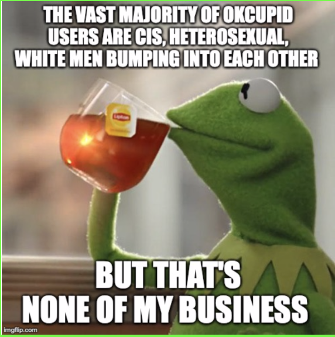

```{r, include = FALSE}
# Necessary Packages

require(tidyverse)
require(okcupiddata)

```

## _Ethnicity, Sex, and Sexual Orientation_


```{r, echo = FALSE}
# Leveling Ethnicity and Sexual Orientation Variables

Laura_Palmer <- profiles %>%
  
  mutate(ethnicity_factor = as.factor(if_else(ethnicity %in% c("asian", "asian, pacific islander", "asian, white"), "Asian+", if_else(ethnicity %in% c("black", "black, hispanic / latin", "black, native american, white", "black, other", "black, white"), "Black+",if_else(ethnicity %in% c("hispanic / latin", "hispanic / latin, other", "hispanic / latin, white", "hispanic / latin, white, other"), "Latinx+", if_else(ethnicity == "indian", "Indian+", if_else(ethnicity %in% c("middle eastern", "middle eastern, white"), "Middle Eastern+", if_else(ethnicity == "native american, white", "Indigenous+", if_else(ethnicity %in% c("pacific islander" , "pacific islander, white"), "Pacific Islander+", if_else(ethnicity %in% c("white", "white, other"), "White+", "N/A")))))))))) %>% 
  
  filter(ethnicity_factor != "NA")

Laura_Palmer <- Laura_Palmer %>% 
  mutate(orientation.factor = as.factor(if_else(orientation %in% c("gay", "bisexual"), "LGBTQ+", "Straight")))

```


```{r, echo = FALSE}
# Visualization #2: 

viz2 <- ggplot(data = Laura_Palmer, mapping = aes(x = ethnicity_factor, fill = sex)) +
  geom_bar(position = position_dodge(preserve = "single")) + 
  coord_flip() + facet_wrap(~ orientation.factor) +
  labs(title = "Sex and Self-Reported Ethnicity with LGBTQ+ Identity", x = "Ethnicity Group", y = "User Count", fill = "Sex") + 
  scale_fill_manual(name = "Sex", labels = c("Female", "Male"), values = c('chartreuse','grey'))

viz2

```


As you can see from this graphic, the vast majority of site users are white straight men $*feminine gasp*$, closely followed by white straight women which far outnumber any other demographic.  In an effort to unpack this disparity we examined some of the recent marketing photos released by the site to analyze how race, gender, and sexuality is portrayed by this dating app. 

$~$
$~$


$~$
$~$


Considering that the San Francisco Bay Area is such a diverse location our group wondered why OkCupid’s population lacked any sort of ethnic diverstiy. One possible cause our group conisdered was the possibility of OkCupid marketing to specific audiences. The newest ad campaign (pictured above) appears to target a wide range of possible users, at least where sexuality is concerned.

However, what we noticed is that all couples who stray from typical binary (multiracial, or queer) are pictured either wearing masks that either partially cover, or totally cover their faces, or have four hands. The one straight couple pictured is the only one that appears to not have extra appendages added or odd slime masks. And its important to note that the ads don’t feature any women of color. Is this a successful ad campaign for OkCupid to be running to increase the site's diversity? Maybe not, since the majority of users are white, cis- gendered, heterosexual males. 

$~$
$~$

## _Accounting for Age_


```{r, echo = FALSE}
# Factoring Age Variable

Laura_Palmer <- Laura_Palmer %>%
  mutate(age_factor = as.factor(if_else(age %in% c(18:25), "18-25", if_else(age %in% c(26:30), "26-30", if_else (age %in% c(31:35), "31-35", if_else(age %in% c(36:40), "36-40", if_else(age %in% c(41:45), "41-45", if_else(age %in% c(46:50), "46-50", if_else(age %in% c(51:55), "51-55", if_else(age %in% c(56:60), "56-60", if_else(age %in% c(61:69), "61-69", "Other")))))))))))

```

```{r, echo = FALSE, include = FALSE}
# Heatmap of Age vs. Ethnicity Data

heatmapdata <- Laura_Palmer %>%
  dplyr::select(ethnicity_factor, age_factor) %>% 
  group_by(ethnicity_factor, age_factor) %>%
  summarise(ethnicitytotal = n()) %>%
  mutate(logethnicity = log10(ethnicitytotal)) %>%
  filter(ethnicity_factor != "NA")

heatmap <- ggplot(heatmapdata, aes(x = age_factor, y = ethnicity_factor)) +
   geom_tile(aes(fill = logethnicity), colour = "white") +
   labs(title = "Heatmap of Particular Age Groups in Each Ethnicity Group", y = "Ethnicity Group", x = "Age Group", fill = "Log10 of Count") +
   scale_fill_distiller(palette = "Greens", na.value = "white",
   direction = 1, labels = c(0, 1, 2, 3, 4))
 
 heatmap
```


“Ok, Boomer.” We aren’t trying to burst your bubble, but OkCupid may be, if you’re looking for a modern dating experience and if you’re a bit up there in age. This visualization shows the density (or approximate number of people on a log10 scale) using OkCupid from a variety of age ranges and ethnicity groupings. Mind our grouping choices: our point here isn’t to diminish those who identify as multiracial/multiethnic (because as we all know, race/ethnicity is vastly heterogeneous), but our point is to show the difference in users of white-identifying race/ethnicity versus other groups, even after we do a bit of generalizing. And our conclusion from before still holds - this platform has a vast majority of active white-identifying users, mostly younger in age, on it when compared to other populations. 




$~$
$~$

## _The Security Question_

“Gettin out there to sow ye wild oats where ye may” is always a somewhat daunting and vulnerable activity (what if the oats reject you?) But privacy concerns in dating apps cast an entirely different emphasis on user vulnerability. Tinder, the most popular dating app, has been criticized for its security flaws regarding user location [^1], however this is nothing compared to the penetration testing of the app 3Fun which revealed a real-time pin map of user locations in Washington DC [^2]. Additionally the site Ashley Madison [^3] was targeted in 2015 posting 32 million users information on the dark web. If you’re considering dipping your toe in the rich petri dish of OkCupid’s cis white adonii, make sure you use appropriate privacy measures and be careful not to reveal personal information on this account, for other online dating platforms have met serious issues with security breaches. With OkCupid collecting similar information, you are always at risk, too.

$~$
$~$


$~$
$~$
$~$

### References 

_Data are from_ [https://github.com/rudeboybert/okcupiddata]

_Kermit Images:_ 

[https://imgflip.com/memetemplate/But-Thats-None-Of-My-Business]
[https://images.app.goo.gl/hy2KzV3uZXbwGc3m8]

_DTF Images:_

[https://theblog.okcupid.com/more-images-from-our-dtf-campaign-revealed-121ad0a153fe]

_In-Text Sources:_

[^1]: https://www.cs.tufts.edu/comp/116/archive/fall2015/mfeltz.pdf

[^2]: https://www.pentestpartners.com/security-blog/group-sex-app-leaks-locations-pictures-and-other-personal-details-identifies-users-in-white-house-and-supreme-court/

[^3]: https://www.wired.com/2015/08/happened-hackers-posted-stolen-ashley-madison-data/


